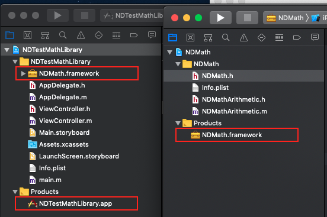
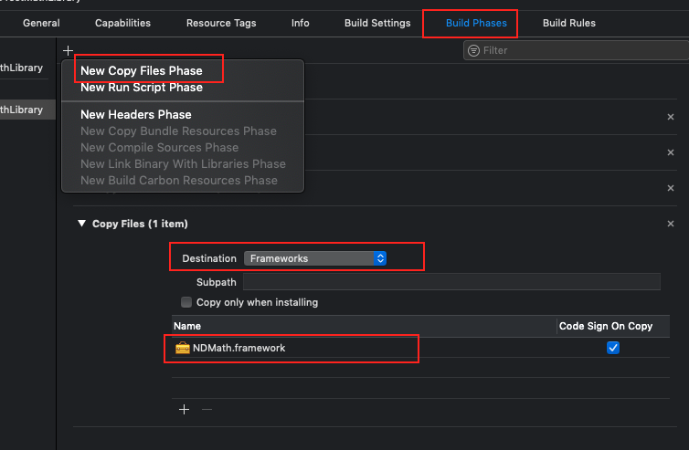

# Issue: Add Framework file only  

I create an cocoa framework project  `NDMatch` and an test Demo `NDTestMathLibrary`:

Then build `NDMath` framework, i got the `NDMath.framework` in product directory。

I have two chooses to use `NDMath` in `NDTestMathLibrary` project:

1. import the NDMath project as framework, and drag `NDMath.framework` in **"Embedded Binaries"**,  in the same time, **"Linked Frameworks and Libraries"** area also add it;
2. someone maybe add `NDMath.framework` in the `NDTestMathLibrary` project only, however does not contain all source file (`.h .m`);



If you build in second choose, en... Build successfully, but crash at startup with error message.

```text
dyld: Library not loaded: @rpath/NDMath.framework/NDMath
  Referenced from: /Users/pmst/Library/Developer/CoreSimulator/Devices/B67CA5B2-8351-48EC-AD5F-D6F872EE2341/data/Containers/Bundle/Application/2301E51D-AE7F-4CE6-89D2-F0C231EEC001/NDTestMathLibrary.app/NDTestMathLibrary
  Reason: image not found
```

> The reason is simple : " image not found ! ".

We just tell the `NDTestMathLibrary` to link  frameworks in `Linked Frameworks and Libraries ` configuration area when startup 。However when build into executable file`NDTestMathLibrary.app` , it doesn't contain `NDMath.framework`。We need copy it into executable file or xx.app file。

### How to resolve this?

1. Drag `NDMath.framework` into `Embedded Binaries` configuration area,  in the meantime, In **Build Phase Tab** ， there will one more copy "Embed Frameworks" option, this will help us to copy file;
2. In addition to this method， we can new **"Copy Files"** operation, select destination Frameworks option and drag `NDMath.framework` into configuration area. If you look back in **General** Tab, The **Embedde Binaries** also add `NDMath.framework` 




