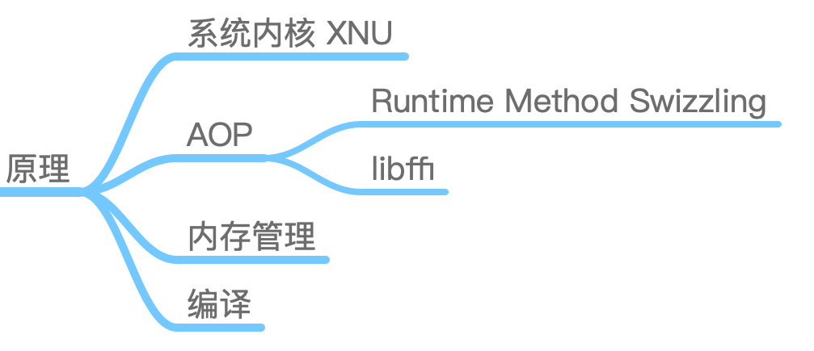
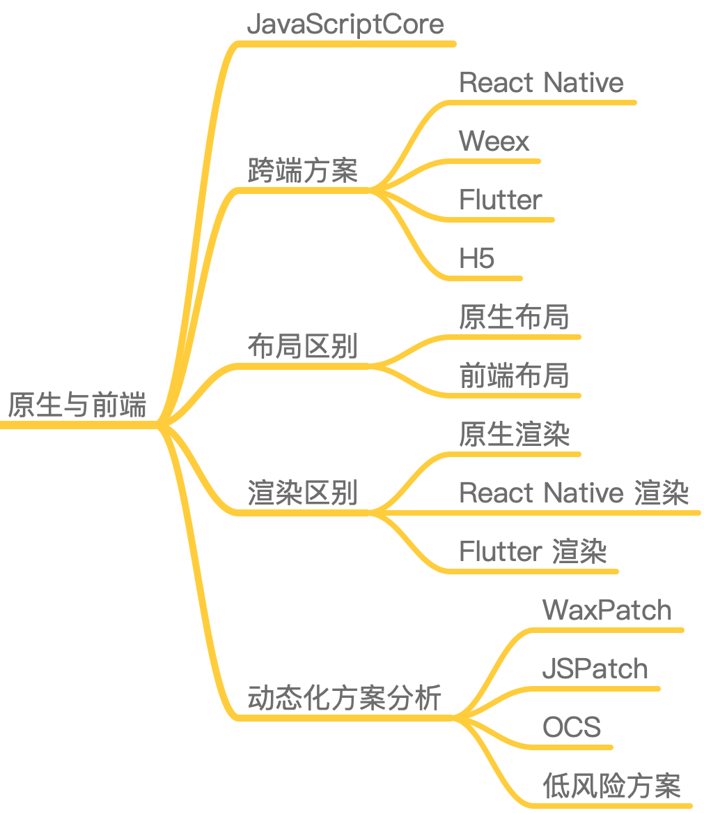

# 01 | 建立你自己的iOS开发知识体系

戴铭将 iOS 的知识体系划分为：基础、原理、应用开发、原生与前端(aka.跨平台方案)，这里的基础和我理解的可能稍有不同。先附上他整理的思维导图，可以说相当言简意赅，非常直观：

## App 开发至上线"宏观知识点"

首先这里按照 App 的开发流程划分知识点，并非特指一个需求从编码到上线。建议发布阶段加入编译，编译速度问题蛮重要的，另外将静态分析，打包，测试进行CI集成；其他也没啥了，再说下我认为的重点，性能优化和架构设计，3年以上的iOS开发不能再局限于业务迭代、画画UI了事，公司的需求不可能无休止地疯狂迭代，一定时间总会趋于稳定，原因有二：产品需求不再是疯狂试探性，而是有调研、有目的性地上版本，基本每个版本需求数量基本差不多了，可以腾出精力优化代码了；项目的架构已经无法承受五花八门的需求迭代，要赶在压死骆驼的最后一根稻草之前对项目重构，优化以满足当下需求，应对未来变化。

## 应用开发(需求开发)

iOS 的需求迭代中涉及的知识点，上面的基础知识点其实并非指 Objective-C 、 Runtime、Runloop等，这些都会划分在原理模块，确实也说的通。

## 原理模块

就DM整理的思维导图来看，涉及知识点只是罗列了一丢丢，其实底层原理感觉就像内功，不是一朝一夕就能练成，而且很多知识点都是交错贯通的，一旦某个任督二脉打通，某一片知识体系就通了。

## 跨平台

接触不多，前端时间玩了下 Flutter，本想深入下渲染机制，最后也不了了之，其实我更想知道一个跨平台方案的设计思路以及底层实现原理，至于如何使用，其实是次要的。

