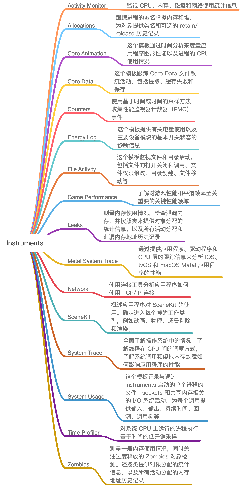
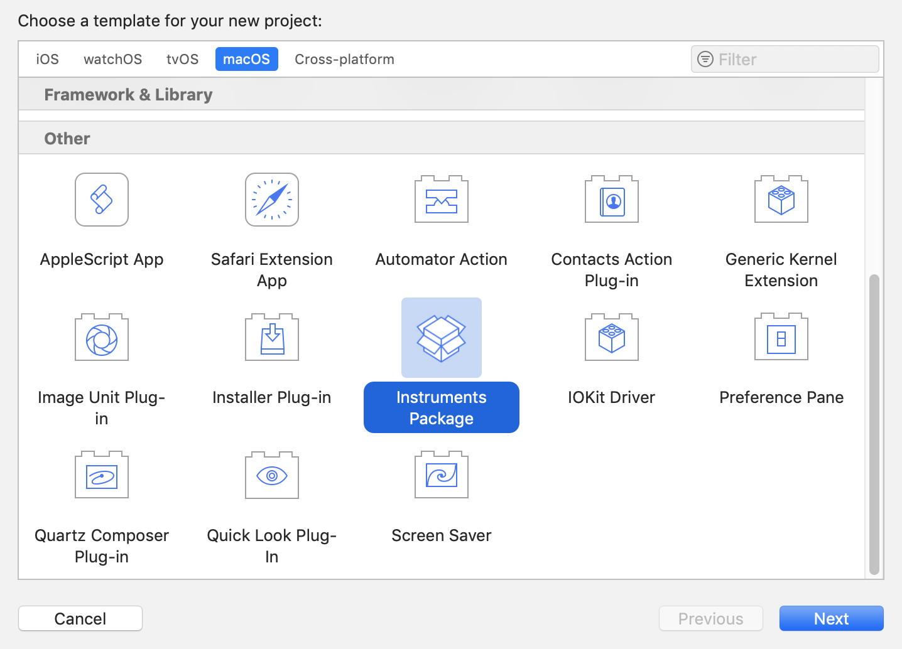

#  16 | 性能监控-衡量App质量的那把尺




Instrument 基于 Standard UI 和 Analysis Core 技术，所以自定义性能检测工具的开发只需要我们提供 UI 和 分析这两点就OK了。

Xcode 中新建流程：



苹果提供了大量的代码片段，帮助你进行个性化的配置。[官方链接](https://help.apple.com/instruments/developer/mac/current/)。

核心还是 Analysis Core，自定义分析需要了解 Instruments收集和处理数据的机制，介绍分为三步：

1. 处理我们配置好的各种数据表，并申请存储空间 store;
2. store 去找数据提供者，如果不能直接找到，就会通过 Modeler 接收其他 store 的输入信号进行合成；
3. store 获得数据源后，会进行 Binding Solution 工作来优化数据处理过程。

**对于开发者来说最重要的是 `os_signpost`**，其作用是允许我们编写代码来获取数据，即在工程中添加 `os_signpost API` 来获取数据，提供给 Analysis Core。

苹果 WWDC 2018 Session 410 [Creating Custom Instruments](https://developer.apple.com/videos/play/wwdc2018/410)提供了范例：通过 `os_signpost API` 将突破下载的数据提供给 Analysis Core 进行监控观察：

```c
os_signpost(.begin, log: parsinglog, name:"Parsing", "Parsing started SIZE:%ld", data.count)
// Decode the JSON we just downloaded
let result = try jsonDecoder.decode(Trail.self, from: data)
os_signpost(.end, log: parsingLog, name:"Parsing", "Parsing finished")

```

begin/end 要成对出现。

Instruments 通过配置数据表来使用这些数据，配置的数据表的 XML 设计如下所示：

```c
<os-signpost-interval-schema>
<id>json-parse</id>
<title>Image Download</title>
<subsystem>"com.apple.trailblazer</subsystem>
<category>"Networking</category>
<name>"Parsing"</name>
<start-pattern>
<message>"Parsing started SIZE:" ?data-size</message> 
</start-pattern>
<column>
<mnemonic>data-size</mnemonic>
<title>JSON Data Size</title>
<type>size-in-bytes</type>
<expression>?data-size</expression>
</column>
</os-signpost-interval-schema>

```

> 在线下性能监控中，Instruments 可以说是王者，但却对线上监控无能为力。


### 线上监控

两个原则：

1. 监控代码不要侵入到业务代码；
2. 采用性能消耗最小的监控方案。

线上性能监控，主要集中在 CPU 使用率、FPS 的帧率和内存三块。


App 进程除了主线程外，还可能起一些线程来处理大计算量的工作，或保活监听处理某些事件。每个线程对 CPU 的使用率不同，各个线程对 CPU 使用率的总和（考虑下多核），就是当前 App 对 CPU 的使用率。

在 iOS 系统中 `/usr/include/mach/thread_info.h` 貌似已经没有了，但是线程基本信息的结构体定义应该不会变的， `cpu_usage` 就是 CPU 使用率。

```c
struct thread_basic_info {
  time_value_t    user_time;     // 用户运行时长
  time_value_t    system_time;   // 系统运行时长
  integer_t       cpu_usage;     // CPU 使用率
  policy_t        policy;        // 调度策略
  integer_t       run_state;     // 运行状态
  integer_t       flags;         // 各种标记
  integer_t       suspend_count; // 暂停线程的计数
  integer_t       sleep_time;    // 休眠的时间
};

```

每个线程都会有这个 thread_basic_info 结构体。定时去遍历每个线程，累加每个线程 `cpu_usage` 字段的值。

```objc
+ (integer_t)cpuUsage {
    thread_act_array_t threads; //int 组成的数组比如 thread[1] = 5635
    mach_msg_type_number_t threadCount = 0; //mach_msg_type_number_t 是 int 类型
    const task_t thisTask = mach_task_self();
    // 根据当前 task 获取所有线程
    kern_return_t kr = task_threads(thisTask, &threads, &threadCount);
    
    if (kr != KERN_SUCCESS) {
        return 0;
    }
    
    integer_t cpuUsage = 0;
    // 遍历所有线程
    for (int i = 0; i < threadCount; i++) {
        
        thread_info_data_t threadInfo;
        thread_basic_info_t threadBaseInfo;
        mach_msg_type_number_t threadInfoCount = THREAD_INFO_MAX;
        
        if (thread_info((thread_act_t)threads[i], THREAD_BASIC_INFO, (thread_info_t)threadInfo, &threadInfoCount) == KERN_SUCCESS) {
            // 获取 CPU 使用率
            threadBaseInfo = (thread_basic_info_t)threadInfo;
            if (!(threadBaseInfo->flags & TH_FLAGS_IDLE)) {
                cpuUsage += threadBaseInfo->cpu_usage;
            }
        }
    }
    assert(vm_deallocate(mach_task_self(), (vm_address_t)threads, threadCount * sizeof(thread_t)) == KERN_SUCCESS);
    return cpuUsage;
}

```


### FPS 线上监控方法

通过注册 CADisplayLink 得到屏幕的同步刷新率，记录每次刷新时间，然后就可以得到 FPS。具体的实现代码如下：

```objc
- (void)start {
    self.dLink = [CADisplayLink displayLinkWithTarget:self selector:@selector(fpsCount:)];
    [self.dLink addToRunLoop:[NSRunLoop mainRunLoop] forMode:NSRunLoopCommonModes];
}

// 方法执行帧率和屏幕刷新率保持一致
- (void)fpsCount:(CADisplayLink *)displayLink {
    if (lastTimeStamp == 0) {
        lastTimeStamp = self.dLink.timestamp;
    } else {
        total++;
        // 开始渲染时间与上次渲染时间差值
        NSTimeInterval useTime = self.dLink.timestamp - lastTimeStamp;
        if (useTime < 1) return;
        lastTimeStamp = self.dLink.timestamp;
        // fps 计算
        fps = total / useTime; 
        total = 0;
    }
}

```

### 内存使用量的线上监控方法

通常情况下，我们在获取 iOS 应用内存使用量时，都是使用task_basic_info 里的 resident_size 字段信息。但是这样获得内存使用量和 Instruments 里看到的想擦很大。

[2018 WWDC Session 416 iOS Memory Deep Dive](https://developer.apple.com/videos/play/wwdc2018/416/)中提到 `phys_footprint`才是实际使用的物理内存。

内存信息存在 `task_info.h` 中的 task_vm_info结构体，其中的`phys_footprint` 就是物理内存的使用，而不是驻留内存 resident_size。结构体定义如下：

```c
struct task_vm_info {
  mach_vm_size_t  virtual_size;       // 虚拟内存大小
  integer_t region_count;             // 内存区域的数量
  integer_t page_size;
  mach_vm_size_t  resident_size;      // 驻留内存大小
  mach_vm_size_t  resident_size_peak; // 驻留内存峰值

  ...

  /* added for rev1 */
  mach_vm_size_t  phys_footprint;     // 物理内存

  ...

```

从结构体出取出`phys_footprint`字段值，就达到监控实际物理内存的使用情况了。具体实现代码如下：

```c
uint64_t memoryUsage() {
    task_vm_info_data_t vmInfo;
    mach_msg_type_number_t count = TASK_VM_INFO_COUNT;
    kern_return_t result = task_info(mach_task_self(), TASK_VM_INFO, (task_info_t) &vmInfo, &count);
    if (result != KERN_SUCCESS)
        return 0;
    return vmInfo.phys_footprint;
}

```


