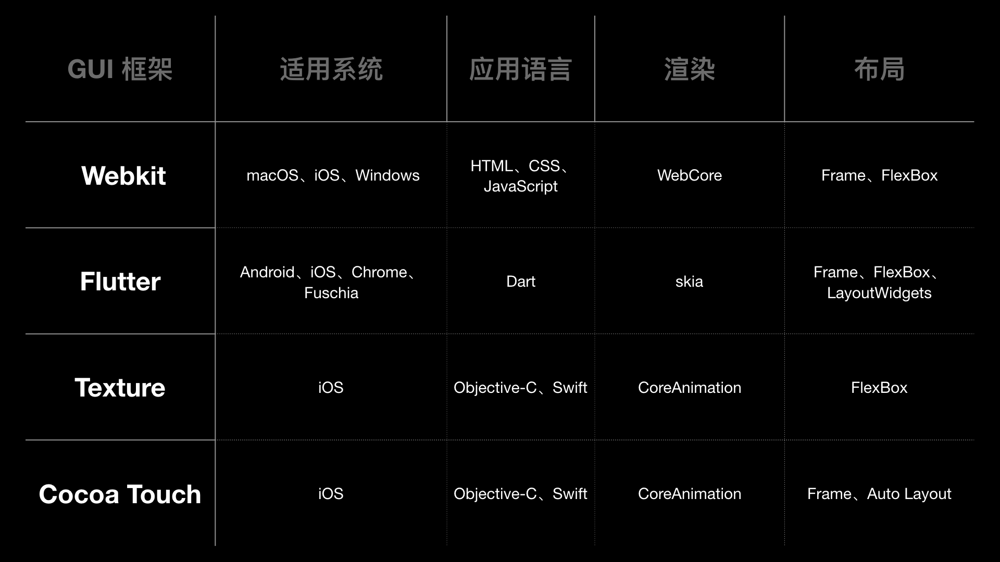
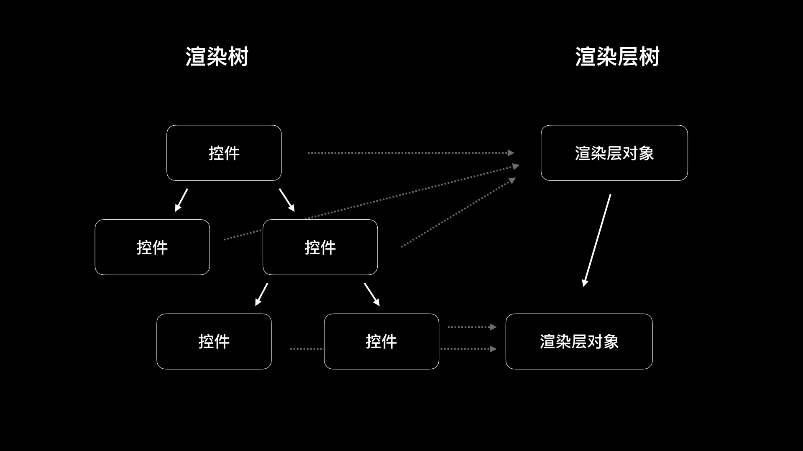
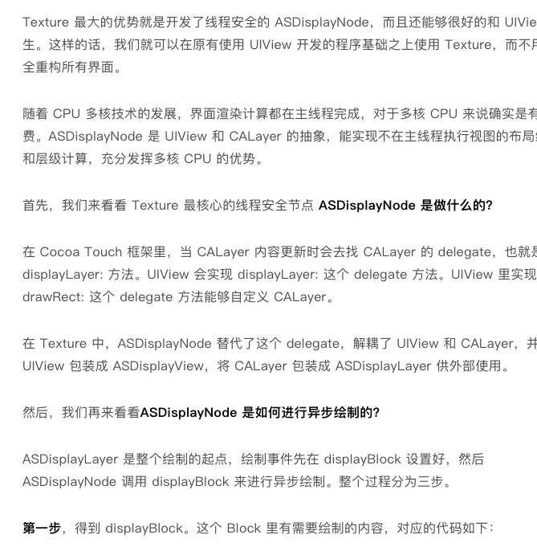

# 21 | GUI框架开发讨论



Texture 核心知识是异步渲染节点(视图)，原理是将视图生成过程(这里有点迷糊，但记得生成主要是image)放到异步线程中，生成完毕在回到主线程将image赋值给 layer.content类似属性，此刻才是真正将屏显数据传递给GPU进行进一步计算，最终显示到物理屏幕中。

> 这里有个疑问，那么在视图渲染过程中，假设极端情况下渲染超慢，那么是否有个"占位视图"一开始就放在那边？？


iOS 界面视图采用渲染树(Render Tree)呈现，包括我们熟知的视图、Button、Label等等。使用抽象的数结构来维护视图层级，布局，位置和大小。

> 基于渲染数，GUI框架还会提供一个渲染层树(RenderLayer Tree, 什么鬼？)渲染层树由渲染层对象组成，根据GUI框架的优化条件来确定创建哪些渲染层对象，每次新创建一个渲染层对象就会去设置它的父对象和兄弟对象。渲染层对象创建完毕，接下来就需要各渲染层对象里的控件按照渲染数布局生成 **Bitmap**，最后GPU就可以渲染 Bitmap 来让你看到界面。

<font color="red">这里Render Tree和RenderLayer Tree不是很理解，前者是指UIView，后者是指Layer层吗，毕竟UIView是CALayer的delegate罢了。有待深究。</font>



文中提到 WebKit 和 Flutter有关GUI框架具体实现控件，渲染树，渲染层树和生成Bitmap的代码。本质原理其实都是差不多的，殊途同归。Thx 开源。


* WebKit 网页加载慢，一般来说是 CSS 和 JS加载，某些时候还可能是资源图片加载问题；
* 同时，解析HTML/CSS/JS需要兼容老版本，JS类型推断失败会重来，列表缺少重用机制等，导致WebKit框架整体性能没有其他框架好，所以H5暂时还不能统一三端；


## 渲染流程

GUI框架中的渲染，一般分为布局、渲染、合成三个阶段。

**布局阶段主要负责计算渲染树中的控件大小和位置。**即使使用约束布局，本质其实还是通过约束引擎计算控件的显示Frame。

**渲染阶段主要负责图形函数计算出界面内容。**一般情况下 2D 平面的渲染都是CPU计算，3D控件渲染使用GPU。

Cocoa Touch 和 Texture 框架使用的Core Animation,3D使用的Metal引擎。Flutter使用的是 Skia，3D使用 OpenGL(ES)。

WebKit 抽象了接口，根据不同平台采用不同方案，iOS为CoreGraphics，Android为 Skia。

**合成阶段：顾名思义是合并图层。**这样做的目的，主要是节省显示内存，只显示一屏需要的像素，也只进行这些像素数据的计算。(这里表述意思应该指如果显示的视图非常大，但是手机屏幕此刻仅显示一部分，而合成工作也只针对当前屏幕所示视图在总视图中的那部分），这个过程完成后，将数据进行光栅化处理，交给GPU渲染成可以看的Bitmap。

> 还是不理解光栅化是什么意思。。。


## Texture

这里直接贴下DM对Texture实现的简述：



贴几点疑问：

1. CALayer 内容更新，指什么更新，怎么触发的？
2. UIView 是CALayer的delegate，意味着display的内容都是由UIView来提供的，而UIView又给我们提供了一个切面方法 drawRect 方法供我们绘制
3. 这里说 ASDisplayNode 替代了 delegate，指什么？CALayer的内容提供方改为Texture的Node了？那还要UIView干啥？ 为什么还有 ASDisplayView ，以及 ASDisplayLayer 定位是啥？

```objc
asyncdisplaykit_async_transaction_operation_block_t displayBlock = [self _displayBlockWithAsynchronous:asynchronously isCancelledBlock:isCancelledBlock rasterizing:NO];
```

**第二步，**定义回调闭包：

```objective-c
asyncdisplaykit_async_transaction_operation_completion_block_t completionBlock = ^(id<NSObject> value, BOOL canceled){
  ASDisplayNodeCAssertMainThread();
  if (!canceled && !isCancelledBlock()) {
    // displayBlock 执行的是绘图操作，返回的类型是 UIImage
    UIImage *image = (UIImage *)value;
    BOOL stretchable = (NO == UIEdgeInsetsEqualToEdgeInsets(image.capInsets, UIEdgeInsetsZero));
    if (stretchable) {
      ASDisplayNodeSetResizableContents(layer, image);
    } else {
      layer.contentsScale = self.contentsScale;
      // 设置为 CALayer 的寄宿图
      layer.contents = (id)image.CGImage;
    }
    [self didDisplayAsyncLayer:self.asyncLayer];
    
    if (rasterizesSubtree) {
      ASDisplayNodePerformBlockOnEverySubnode(self, NO, ^(ASDisplayNode * _Nonnull node) {
        [node didDisplayAsyncLayer:node.asyncLayer];
      });
    }
  }
};
```

文中说Core Graphic 是线程安全的？？？？？？？

**第三步,**如果设置为异步展示，就先向上找到属性 `asyncdisplaykit_parentTransactionContainer` 为 YES 的CALayer，获取 containerLayer 的ASAsyncTransaction，然后将 displayBlock 添加到 ASAsyncTransaction的调度队列中，根据优先级执行 displayBlock:

```objc
if (asynchronously) {
  // 向上找到属性 asyncdisplaykit_parentTransactionContainer 为 YES 的 CALayer
  CALayer *containerLayer = layer.asyncdisplaykit_parentTransactionContainer ? : layer;
  
  // 获取 containerLayer 的 ASAsyncTransaction
  _ASAsyncTransaction *transaction = containerLayer.asyncdisplaykit_asyncTransaction;
  
  // 将 displayBlock 添加到 ASAsyncTransaction 的调度队列里
  [transaction addOperationWithBlock:displayBlock priority:self.drawingPriority queue:[_ASDisplayLayer displayQueue] completion:completionBlock];
} else {
  // 设置为不是异步就直接调用 displayBlock 进行绘制
  UIImage *contents = (UIImage *)displayBlock();
  completionBlock(contents, NO);
}

```


