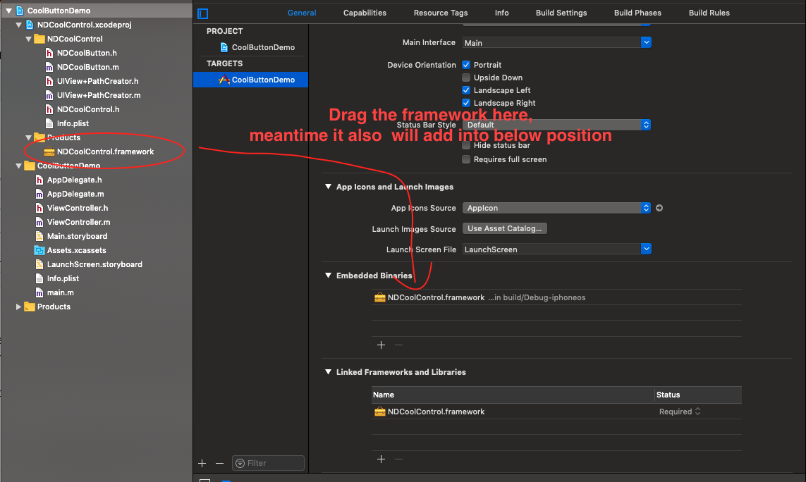
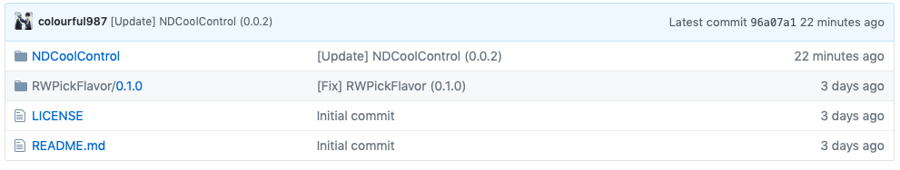

# Learning Create Framework And Use CocoaPods Procedure

[TOC]

The five demo can help you to create your own framework, publish it to github for other people. I learned from [Raywenderlich tutorial](https://www.raywenderlich.com/5109-creating-a-framework-for-ios), it's imp by swift, so I re-write by  objective-c. Thx again.

## Step1 : all in signal project

## Step2 : extract files into framework

Some things you must note:

First, we create framework use the `Cocoa Touch Framework` option which Xcode provide;Then  you use "Add Files Into xxx "(`option+cmd+A`) operation to add the frame work; **Note!!**  you will build failed no doubt this monents. Because even though the two projects are now together, but **CoolButtonDemo** still doesn't get  our custom control. It's they're sitting in the same room, but **CoolButtonDemo** can't see the new framework.



the other problem is that: look the content of `NDCoolControl.h` file

```objective-c
// In this header, you should import all the public headers of your framework using statements like #import <NDCoolControl/PublicHeader.h>
#import <NDCoolControl/NDCoolButton.h>
```

However it report "can not find .h file", in my project, the problem is `NDCoolButton.h` is private for callers!! It need public access control. 

Select `NDCoolButton.h` file , find target membership setting, change private to public solved this issue. 

## Step3 : cocoapod for local framework

In step3, I occurred a problem. It report "can not find .h file" again....

I found the  `Profile`  file use wrong configuration:

```
target 'CoolButtonDemo' do
  # Uncomment the next line if you're using Swift or would like to use dynamic frameworks
  use_frameworks! # I forget it
  pod 'NDCoolControl', :path => '../NDCoolControl'
end

```

when to use `use_frameworks!` :

1. Use CocoaPods import swift framework into your project
2. Use dynamic frameworks
```
use_frameworks! -> dynamic frameworks -> .framework
#use_frameworks! -> static libraries -> .a
```

In fact , import oc framework into our oc project, default use `#use_frameworks` ...

## Step4 : cocoapod for remote framework

without issues

## Step5 : create  private Specs for remote framework

First we create a privacy spec repo，like [mine](https://github.com/colourful987/RWPodSpecs);  This repo will store all `.podspec` files. 

As we know, every pod framework must have a `.podspec` file. so our podfile can write like this:

```ruby
pod 'NDCoolControl', :git => 'https://github.com/colourful987/NDCoolControl', :tag => '0.0.1'
```

If we have more , podfile will be repetitive and mass:

```
pod 'pod1', :git => 'address1', :tag => '0.0.1'
pod 'pod2', :git => 'address2', :tag => '0.0.1'
pod 'pod3', :git => 'address3', :tag => '0.0.1'
pod 'pod4', :git => 'address4', :tag => '0.0.1'
pod 'pod5', :git => 'address5', :tag => '0.0.1'
...
```

This is no problem, because we designated git address and tag, pod will help us to download pods we needed.

However, we create a special repo in order to store all podspec files. Like this:



Our podfile need know the privacy spec repo, so add the first line:

```ruby
source 'https://github.com/colourful987/RWPodSpecs.git'
# another specs repo
target 'CoolButtonDemo' do
  # Uncomment the next line if you're using Swift or would like to use dynamic frameworks
  use_frameworks!
  pod 'NDCoolControl', '~> 0.0.2' 
end
```

As you can see,  `pod 'NDCoolControl', '~> 0.0.2'` is shorter than previous.


