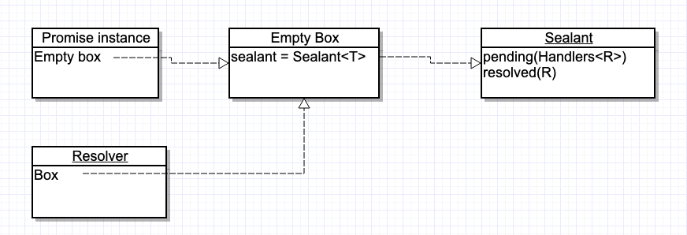

# 【初级入门】PromiseKit 实战练习

新建空 iOS 工程，然后在目录下`pod init` 初始化pod，生成的Podfile中引入PromiseKit:

```ruby
# Uncomment the next line to define a global platform for your project
# platform :ios, '9.0'

target '7-17-PromiseDemo' do
  # Comment the next line if you don't want to use dynamic frameworks
  use_frameworks!

	pod "PromiseKit", "~> 6.8"

end
```

执行`pod install`安装 promiseKit 库，此时会引入 CorePromise 以及 Foundation 扩展 ，本文用到的 Promise 对 NSURLSession 的扩展。

接着在 ViewController 中测试代码：

```swift
import UIKit
import PromiseKit


struct Foo : Decodable {
    let message:String
    let nu:String
    let ischeck:String
    let com:String
    let status:String
    let condition:String
    let state:String
    let data:Array<Dictionary<String,String>>

}

class ViewController: UIViewController {

    override func viewDidLoad() {
        super.viewDidLoad()
        
        print("开始执行异步请求操作")
        firstly {
           URLSession.shared.dataTask(.promise, with:try makeUrlRequest()).validate()
        }.map {
            try JSONDecoder().decode(Foo.self, from: $0.data)
        }.done { value in
            print("value :\(value)")
        }.catch {
            error in
            print(error)
        }
        
        print("这里马上会被执行到")
    }

    func makeUrlRequest() throws -> URLRequest {
        let str = "https://www.kuaidi100.com/query?type=shentong&postid=125262"
        let urlwithPercentEscapes = str.addingPercentEncoding(withAllowedCharacters: .urlQueryAllowed)
        let url = URL(string: urlwithPercentEscapes!)
        
        var rq = URLRequest(url: url!)
        rq.httpMethod = "POST"
        rq.addValue("application/json", forHTTPHeaderField: "Content-Type")
        rq.addValue("application/json", forHTTPHeaderField: "Accept")
        //        rq.httpBody = try JSONEncoder().encode(obj)
        return rq
    }
}
```

上面实现了异步发起请求，该请求返回数据，然后JSON解码成Model，接着做其他一些UI刷新操作，当然如果还需要处理错误。

> 如何使用 PromiseKit 上面代码已经非常清楚，现在通过上述测试Demo，再温习下源码实现思想。

##Demo 源码分析

PromiseKit 帮助我们从地狱嵌套的异步操作中解放出来，以一种更优雅、简洁的方式链式执行。

```swift
firstly {
   URLSession.shared.dataTask(.promise, with:try makeUrlRequest()).validate()
}.map {
    try JSONDecoder().decode(Foo.self, from: $0.data)
}.done { value in
    print("value :\(value)")
}.catch {
    error in
    print(error)
}
```

这里异步操作的发起点是`URLSession.shared.dataTask(.promise, with:try makeUrlRequest()).validate()`，这里借助了 Swift 的闭包特性，如果闭包中仅一个表达式，则表达式的结果值就是闭包的返回值，因此`dataTask` 返回的就是 Promise 对象。

> PromiseKit 世界串联异步操作的媒介 —— Promise 实例。

```swift
public func dataTask(_: PMKNamespacer, with convertible: URLRequestConvertible) -> Promise<(data: Data, response: URLResponse)> {
  return Promise { dataTask(with: convertible.pmkRequest, completionHandler: adapter($0)).resume() }
}
```

这里用到 Promise 构造方法：

```swift
public init(resolver body: (Resolver<T>) throws -> Void) {
  box = EmptyBox()
  let resolver = Resolver(box)
  do {
    try body(resolver)
  } catch {
    resolver.reject(error)
  }
}
```

如上述 `body` 闭包内容就是 `dataTask(with: convertible.pmkRequest, completionHandler: adapter($0)).resume()`，同样这也是我们自定义的**异步操作**，异步意味着有回调，也就是诸如 `completetionHandler`闭包，我们在闭包中会得到结果值或错误，按照旧思维，此处应该对值做进一步处理；而 Promise 的思想就是将结果值（这里是 `(data: Data, response: URLResponse)` ）用 `resolver` 转成 `result` 值后，再封存到Box中，而Box则是被 promise 实例持有。上面代码中 `$0` 就是 `resolver`，下面是个适配器。

```swift
private func adapter<T, U>(_ seal: Resolver<(data: T, response: U)>) -> (T?, U?, Error?) -> Void {
    return { t, u, e in
        if let t = t, let u = u {
            seal.fulfill((t, u))
        } else if let e = e {
            seal.reject(e)
        } else {
            seal.reject(PMKError.invalidCallingConvention)
        }
    }
}
```

类持有关系如下图所示：



其中结果值我们都用 `Result` 包装了一层，枚举中的 R 泛型就是它。

理一下流程：

1. 实例化一个 promise 对象，构造方法用 `public init(resolver body: (Resolver<T>) throws -> Void)`，我们自定义的异步操作就被封装在 `body` 闭包中，promise 对象内部并不持有这个body闭包，而是会立刻执行；
2. `body` 闭包执行之前，我们先实例化一个 box 对象并持有；然后传入该box对象实例化一个 `resolver` 对象用于之后处理结果值；
3. 最后一步是将 `resolver` 对象作为闭包参数传入执行 `body()`，这个 `resolver` 对象在 `body` 内部调用时机是在 completionHandler 回调之时，只不过各个业务方、自定义操作都需要自己实现一个适配器。


