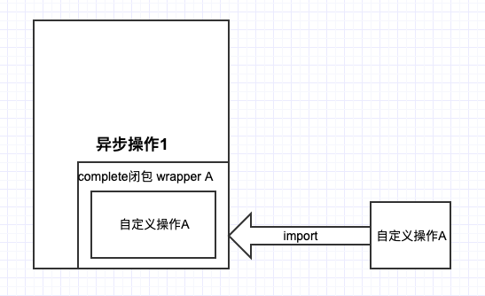
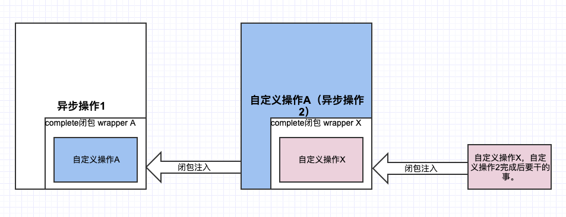
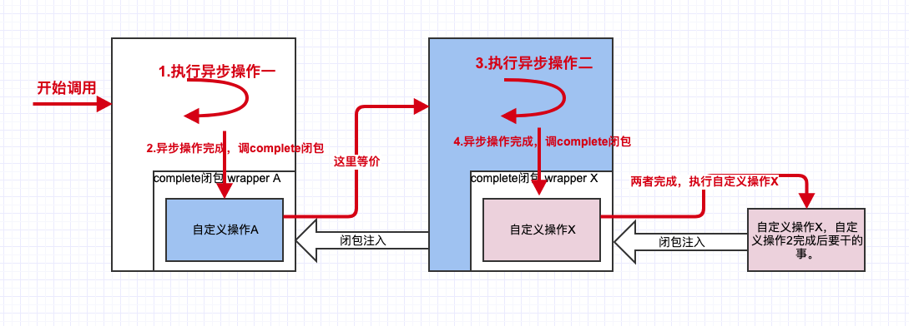
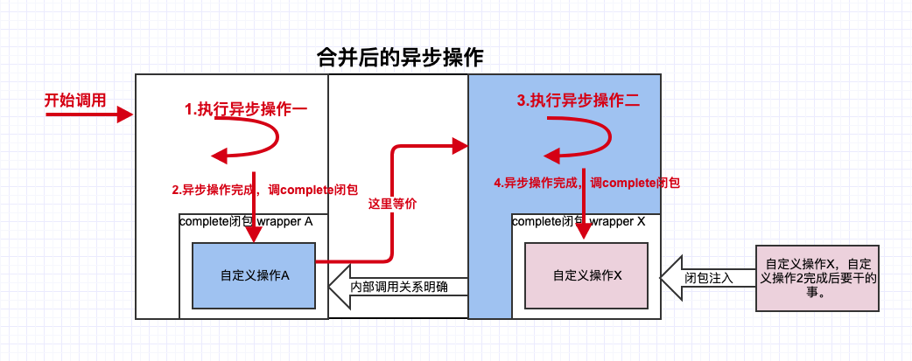
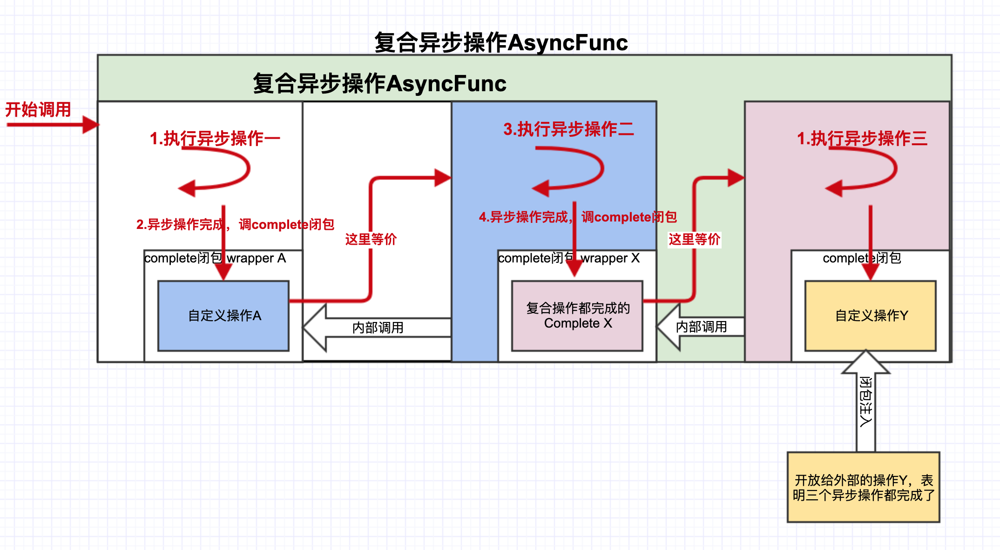

# 【初级入门】自己实现一个PromiseKit

> 这两天把 WWDC 2019 Session 中的 Combine 基础篇和实践篇看完，大致捋顺了 Combine 中的 Publisher、Subject、Subscriber等知识点，目前Xcode Beta2依旧不支持Session中提到的语法糖，可能要等正式版出来才会全部开放。
>
> 响应式框架 ReactiveCocoa，RxSwift，PromiseKit 早前也有略微了解，不过并没有深入，也没有用其写过项目。这次趁着机会学习一波，探究这几个框架是如何实现“函数式“或”响应式”的，以及框架中哪些是可以值得借鉴学习的。
>
> 第一个拿来“开刀”的是 **PromiseKit**，它是一种设计模式，增强代码可读性和维护性，这一点在之后的学习中体现的尤为明显。作者是 Max Howell 大神，如果表示没听过，那么来说说 `Homebrew` ，这个占据了MacOS中重要的包管理工具总该知道吧！也是出自他手。
>
> 非常感谢[莲叔](https://www.jianshu.com/u/9efd08855d3a)的两篇《Swift脑洞系列》教程，通俗易懂，帮助学习 PromiseKit 实现大有裨益，比直接撸源码要轻松很多，我在学习之后大呼过瘾，打算写篇文章记录下，谈谈自己对PromiseKit的理解，同时用Swift5.1来实现下文中例子。

## 异步操作

> 假设场景：网络请求图片资源，请求完成后更新视图。这里异步操作常用到的有三：设置 delegate 回调，请求完成后，通过 `[_delegate didFinishedTask:]` 告知；请求函数传递 `success` 和 `failed` block 作为成功和失败回调，请求完成后调用该代码块；Notification 通知。

这里以第二种为例：

```swift
func asyncOperation(complete : ()-> Void){
    // 异步执行任务，通常借助 GCD dispatch到 globalQueue 执行任务
 		// 如果不借助GCD，就是自己起一个线程执行任务。
  	// 任务是过程式，即一行行执行代码，执行完毕紧接着调用complete
  	DispatchQueue.global().async {
      // do something ...
    	complete()
    }
}
```

实际开发中常遇到先发请求A，回调中拿参数 X 发请求B，回到中拿参数 Y 发请求 C，如果用伪代码表示就是：

```swift

func requestA(complete : @escaping (String)-> Void){
    DispatchQueue.global().async {
        print("请求A完成")
        complete("A参数")
    }
}

func requestB(complete : @escaping (String)-> Void){
    DispatchQueue.global().async {
        print("请求B完成")
        complete("B参数")
    }
}

func requestC(complete : @escaping (String)-> Void){
    DispatchQueue.global().async {
        print("请求C完成")
        complete("C参数")
    }
}

print("发起请求A")
requestA { (responseA) in
    print("拿请求A的参数\(responseA) 发起请求B")
    
    requestB { (responseB) in
        print("拿请求B的参数\(responseB) 发起请求C")
        
        requestC { (responseC) in
            print("All Request Done")
        }
    }
}

RunLoop.main.run()

//=========== 输出 ============
/*
发起请求A
请求A到来
拿请求A的参数A参数 发起请求B
请求B到来
拿请求B的参数B参数 发起请求C
请求C到来
All Request Done
*/ 
//=============================
```

如果去掉`print` 日志信息，那么由requestA作为发起的嵌套请求-回调将是噩梦（`callback hell`）：

```swift
requestA { (responseA) in
    requestB { (responseB) in
        requestC { (responseC) in
            print("All Request Done")
        }
    }
}
```

既然这么写会导致 callback hell ，那么我们就得换一种表现上简洁、易懂的写法，当然是本质不会变的，依旧是异步+回调。

明确下一个进行异步操作的方法是怎么样的：

```swift
func asyncOperation(complete : ()-> Void){
    // 异步执行任务，通常借助 GCD dispatch到 globalQueue 执行任务
 		// 如果不借助GCD，就是自己起一个线程执行任务。
  	// 任务是过程式，即一行行执行代码，执行完毕紧接着调用complete
  	DispatchQueue.global().async {
      // do something ...
    	complete()
    }
}
```

方法会提供一个 `complete` 闭包，这里类型定义比较简单:`(String)-> Void`，方法内部的异步实现这里用到了 GCD，返回值为 `Void`。因此简单的异步操作方法的类型为：

```swift
typealias AsyncFunc = ((String)->Void) -> Void
```

这里的 `asyncOperation` 方法就是 `AsyncFunc` 类型，它接收`()->Void`函数指针参数，返回值为空。

> 我们定制了两个异步操作的执行顺序(**这一点相当重要**)，规则1：第一个异步操作完成后，在`complete`闭包中执行下一个异步操作；规则2：两个异步操作同时进行，但是必须等两个操作都完成后才能执行下一步操作。


**实现规则一：第一个异步操作完成，执行下一个异步操作。**

现在我们将两个**异步操作** ”揉“成一个操作，但这个操作是“冷”的，并未被执行。而揉成的新操作内部持有两个异步操作，以我们约定的规则进行调用。

```swift
func concat(left:AsyncFunc,right:AsyncFunc) -> AsyncFunc {
    return {
        complete in
        
    }
}
```

按照之前说的我们将两个异步操作传入，“揉”成一个新的异步操作返回，这个方法命名为 `concat`，实现模板如上。

方法具体的实现规则是先调用 left 异步操作，完成后再调用 right 异步操作，两者都完成了才执行complete闭包，这个是新操作开放给外部的接口——允许用户在两个异步操作完成后执行一些其他事务项。

```swift
func concat(left:@escaping AsyncFunc,right:@escaping AsyncFunc) -> AsyncFunc {
    return {
        complete in
      	// 《=== 1. 调用 left 异步操作
        left { // 《=== 2. 这里传入的是 left 异步操作的 complete 闭包，执行的是调起 right闭包
            _ in 
          	// 《=== 3. 正如你所看到这里调用 right 异步操作
            right { // 《=== 4. 这里同样传入的 right 异步操作的 complete 闭包，表明两个操作都完成时应该执行开放给外部的 complete 闭包
                _ in
                complete("all done")
            }
        }
    }
}
```

仔细阅读下上面的注释应该可以简单理解这里的思想。

```swift
let concatRequest = concat(left: requestA, right: requestB)

// 调用合并后的操作，并传入complete闭包，即当两个请求都完成后，我们需要做什么
concatRequest { response in 
    print("请求完毕")
}
```

一个异步操作形如下图：



而两个异步操作按照我们期望的规则： **先执行异步操作1，完成后执行异步操作2，操作2完成后再执行最终操作X**。



此刻只是把两个操作串联起来，它们处于待命状态，一旦你调用异步操作1函数，这才开始“一出好戏”。



安排的明明白白，代码形如：

```swift
requestA { (responseA) in
    requestB { (responseB) in
        requestC { (responseC) in
        }
    }
}
```

现在如果要将两个异步操作合并成一个操作，那么我们需要明确的是异步操作之间的调用关系是已经决定的，所以也就意味着**第一个异步操作的complete必定是调用第二个异步操作；**其次，注意第二个异步操作同样接收了一个 complete，这个闭包是在**异步操作二完成后调用，换句话说就是两个异步操作都完成时调用**！因此合并后的新操作应该是这样的。



封装了异步操作1和操作2的**新操作X**，同样是对外开放一个complete接口，但其时机是内部封装的两个异步操作按既定顺序执行完毕后调用。源码再贴一遍：

```swift
typealias AsyncFunc = ((Void)->Void) -> Void

func concat(left:@escaping AsyncFunc,right:@escaping AsyncFunc) -> AsyncFunc {
  	// 定义咱们合并后的异步操作，首先是对外要提供一个 complete 接口
  	// 所以就是下面这么写，complete 类型为 (String)->Void 
    // 即这个闭包是两个操作完成后调用的，告诉你两操作的结果值(String类型)
    return {
        complete in //《=== 这个就是外部要传入的参数，说白了就是函数指针
    }
}
```

至于内部实现咱们照着上图的红色箭头写：

```swift
func concat(left:@escaping AsyncFunc,right:@escaping AsyncFunc) -> AsyncFunc {
    return {
        complete in //《=== 这个就是外部要传入的参数，就当是函数指针
        // 先调用left 异步操作1，当然这里在left complete的闭包中绑定
      	// 之后的操作：即执行right 异步操作2
        left {  _ in 
             // 这里同理，在right complete闭包中注册完成事件，
             // 此刻left right 两个异步操作完成，就要执行complete闭包
             // 它是由外部传入的，上图最右侧粉色框
          	 right { _ in 
                    complete()
             }
        }
    }
}
```

 `concat` 函数将两个异步操作合并成一个新的 `AsyncFunc` 返回，内部handle flow按照约定好的走：先执行异步操作一，完成时调用异步操作2，等它完成时（此刻两个异步操作都完成了）调用外部传入的 `complete` 闭包。

那么 `concat` 得到的复合异步操作，继续串联一个简单异步操作又是如何呢？

由于返回的复合异步操作是 `AsyncFunc`，所以复合 concat 函数的传参，因此可以继续调用，如图所示：



以此类推，所以concat可以一直无限下去，但是现在的问题是写法不友好：

```swift
var compoundAsyncFunc = concat(baseAsync1,baseAsync2)
var compoundAsyncFunc1 = concat(compoundAsyncFunc,baseAsync3)
var compoundAsyncFunc2 = concat(baseAsync4,compoundAsyncFunc1)
//... 😲...
```

所以我们想要提供一种更优雅的方式，比如用操作符，这归功于Swift的特性，允许我们自定义操作符，所以延续莲叔的定义:

```swift
infix operator +>: AdditionPrecedence

func +> (left : @escaping AsyncFunc, right:@escaping AsyncFunc) -> AsyncFunc {
    return {
        complete in 
        left {  _ in
          	 right { _ in 
                    complete()
             }
        }
    }
}
```

所以上面的调用改为：

```swift
var compoundAsyncFunc1 = baseAsync1 +> baseAsync1 +> baseAsync3
var compoundAsyncFunc2 = baseAsync4 +> compoundAsyncFunc1
```

> 思考： baseAsync4 +> baseAsync1 +> baseAsync1 +> baseAsync3 是否可以直接这样，结合律？


上面的异步两个异步操作的 handle flow 规则已经熟知，那么还有一种方式，现定义如下：**异步操作1和异步操作2同时执行，但是必须等两个都完成后才能继续下一步，一般是执行用户注入的complete闭包**。

有了之前的继续，现在实现这种关系的操作就非常简单了，我们只需要为每个异步操作设定一个flag标识是否完成就可以啦，然后判断 ` leftComplete && rightComplete` 就行，下面直接贴操作符代码，一步到位：

```swift
infix operator <>: AdditionPrecedence


func <> (left : @escaping AsyncParamFunc, right:@escaping AsyncParamFunc) -> AsyncParamFunc {
    return {
        info, complete in
        var leftComplete = false
        var rightComplete = false
        var finishedComplete = false
        
        var leftResult:AnyObject? = nil
        var rightResult:AnyObject? = nil
        
        let checkComplete = {
            if leftComplete && rightComplete {
                objc_sync_enter(finishedComplete)
                if !finishedComplete {
                    let finalResult :[AnyObject] = [leftResult!,rightResult!]
                    complete(finalResult as AnyObject)
                    finishedComplete = true
                }
                objc_sync_exit(finishedComplete)
            }
        }
        
        left(info){
            result in
            leftComplete = true
            leftResult = result
            checkComplete()
        }
        
        right(info){
            result in
            rightComplete = true
            rightResult = result
            checkComplete()
        }
    }
}
```

> 思考：既然是异步操作，不可避免会和多线程挂钩，那么就必须对标识加锁，否则会执行异常，举个例子，如果left right 两异步操作都执行完毕，先执行left的complete闭包，设定 `leftComplete = true`，此时CPU立马枪头一调，时间片给了right的complete，那么执行完 `checkComplete`时就会满足条件执行下去，最后时间片又给回left，也能checkComplete成功执行下去，这下就糟糕了，执行了两次！！所以加锁非常有必要哦。


## Promise 的简单实现

主要实现几个关键函数：`firstly`，`then`，`always`，`when`。

通过上面多图展示，显然我们需要自定义一个类来Wrapper这些异步操作，然后开放API以几种规则来 concat 两个异步操作。话不多说，先简单定义一个 Promise 类：

```swift
class Promise {
    var chain:AsyncFunc
    var alwaysClosure: (()->Void)?
    var errorClosure:((Error?)->Void)?
    
    init(starter:@escaping AsyncFunc) {
        chain = starter
    }
    
    func then(body:@escaping (AnyObject) throws -> Void) ->Promise { }
    
    func always(closure:@escaping (() ->Void)) ->Promise{ }
    
    func error(closure : @escaping ((Error?)->Void))->Promise{}
    
    func fire(){}
}
```

这里主要就介绍一个 then 函数，中文意思就是**“接着”**干嘛的意思，也就是不断往我们的工作流中添加任务项，你以为我要说用数组或者链表来保存这些任务项？？？

> 可以，但没必要… 手动滑稽。

言归正传，我们这里用一个 AsyncFunc 类型的 chain 变量，这里理解为一个函数指针，函数接收一个 complete 闭包参数，这个是 **连接** 其他异步操作的桥梁，我们在 `+>` 或 concat 函数中为两个异步操作建立调用关系。所以 `then` 函数就是内部在不断 `chain +> = asyncFunc` 。But，你注意到 `then` 函数似乎传入的并不是 AsyncFunc 类型，是调用者具体的实现，这可怎么办？既然直接不行，那么就间接！我们在 `then` 内部Wrapper 这个实现成一个 AsyncFunc 不就可以了嘛！

```swift
func then(body:@escaping (AnyObject) throws -> Void) ->Promise {
  let async:AsyncFunc = {
    info, complete in
    DispatchQueue.global().async {
      var error:Error?
      do{
        try body(info!)
      } catch let err as Error{
        error = err
      }
      complete(0 as AnyObject,error)
    }
  }
  chain = chain +> async
  return self
}
```

其他的实现就更简单了：

```swift
class Promise {
    var chain:AsyncFunc
    var alwaysClosure: (()->Void)?
    var errorClosure:((Error?)->Void)?
    
    init(starter:@escaping AsyncFunc) {
        chain = starter
    }
    
    func then(body:@escaping (AnyObject) throws -> Void) ->Promise {
        //... 👆
    }
    
    func always(closure:@escaping (() ->Void)) ->Promise{
        alwaysClosure = closure
        return self
    }
    
    func error(closure : @escaping ((Error?)->Void))->Promise{
        errorClosure = closure
        self.fire()
        return self
    }
    
    func fire(){
        chain(0 as AnyObject){
            info, error in
            if let always = self.alwaysClosure {
                always()
            }
            
            if error == nil{
                print("all task finished")
            } else {
                if let errorC = self.errorClosure{
                    errorC(error)
                }
            }
        }
    }
}
```

你可能在诧异 firstly 和 when 呢？我们把它们单独拎出来变成一个函数。

```swift
func firstly(body : @escaping ()->Void)->Promise{
    let starter: AsyncFunc = { _,complete in
        DispatchQueue.global().async {
            body()
            complete(0 as AnyObject,nil)
        }
    }
    
    return Promise(starter: starter)
}
```

when 比较有意思一些，这里的操作有点骚气，尤其是在 `while` 这里，思考下什么场景要这样。

```swift
func when(fstBody : @escaping (()->Void), sndBody : @escaping (()->Void)){
    let async1 : AsyncFunc = { _ , complete in
        DispatchQueue.global().async {
            fstBody();
            complete(0 as AnyObject,nil);
        }
    }
    
    let async2 : AsyncFunc = { _ , complete in
        DispatchQueue.global().async {
            sndBody();
            complete(0 as AnyObject,nil);
        }
    }
    
    let async = async1 <> async2
    
    var finished = false
    
    async(0 as AnyObject) { (_, _) in
        finished = true
    }
    
    while finished == false {
        
    }
}
```

实际测试下代码：

```swift
firstly { () in
    when(fstBody: { () in
        print("begin fst job")
        sleep(2)
        print("fst job in when finished")
    }, sndBody: { () in
        print("begin snd job")
        sleep(5)
        print("snd job in when finished")
    })
}.then { (info) in
        print("second job")
}.then { (info) in
        print("third job")
}.always { () in
        print("always block")
}.error { (error) in
        print("error occurred")
}


RunLoop.main.run()
```

 ## PromiseKit 源码分析

[PromiseKit源码分析文章](./PromiseKit源码分析.md)


# Reference

* [【Swift脑洞系列】轻松无痛实现异步操作串行](https://www.jianshu.com/p/168f92164f06)

* [【Swift 脑洞系列】并行异步运算以及100行的`PromiseKit`](https://www.jianshu.com/p/656bebe7aa6e)