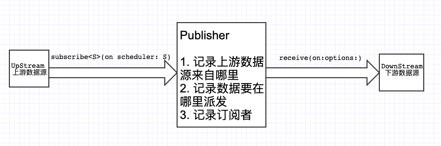

# 观察者模式

熟知的观察者模式，其中 Subject 主题接口定义如下：

```java
public interface Subject {
  public void registerObserver(Observer o);
  
  public void removeObserver(Observer o);
  
  public void notifyObservers();
}
```

观察者：

```java
public interface Observer {
  public void update(data...)
}
```

Subject 一般内部会用一个容器类型变量（比如数组或字典）存储所有观察者，`notifyObservers` 被调用因为当前主题**内部/外部**变更了状态，要通知所有观察者这个事件，应该就是遍历所有观察者，调用`update` 方法。

# Publisher

个人觉得发布者和主题是一个意思，一个主题`receive` 订阅者 `subscribe` 等同于`registerObserver` 注册行为，

这个看官方注解应该很明了，一旦attached这个订阅者就可以开始接收数据拉。

```swift
public protocol Publisher {

    /// The kind of values published by this publisher.
    associatedtype Output

    /// The kind of errors this publisher might publish.
    ///
    /// Use `Never` if this `Publisher` does not publish errors.
    associatedtype Failure : Error

    /// This function is called to attach the specified `Subscriber` to this `Publisher` by `subscribe(_:)`
    ///
    /// - SeeAlso: `subscribe(_:)`
    /// - Parameters:
    ///     - subscriber: The subscriber to attach to this `Publisher`.
    ///                   once attached it can begin to receive values.
    func receive<S>(subscriber: S) where S : Subscriber, Self.Failure == S.Failure, Self.Output == S.Input
}
```

当然不解的是为啥用 receive这个词？ extension 确实给了`subscribe` 这个“看似更合理”的方法接口名，但是似乎有些“不对劲”，注意看函数名（`subscribe<S>(on scheduler...`）。看接口描述：scheduler 调度者，例子中是队列：main，全局和自定义队列，注意这个调度者其实是 Publisher 的**上游数据提供者。**否则你以为发布者凭空捏造数据啊？该函数返回的是一个新的 publisher，它能够执行上游数据源的一系列操作，毕竟是绑定在一个调度者上。

```swift
extension Publisher {

    /// Specifies the scheduler on which to perform subscribe, cancel, and request operations.
    ///
    /// In contrast with `receive(on:options:)`, which affects downstream messages, `subscribe(on:)` changes the execution context of upstream messages. In the following example, requests to `jsonPublisher` are performed on `backgroundQueue`, but elements received from it are performed on `RunLoop.main`.
    ///
    ///     let ioPerformingPublisher == // Some publisher.
    ///     let uiUpdatingSubscriber == // Some subscriber that updates the UI.
    ///
    ///     ioPerformingPublisher
    ///         .subscribe(on: backgroundQueue)
    ///         .receiveOn(on: RunLoop.main)
    ///         .subscribe(uiUpdatingSubscriber)
    ///
    /// - Parameters:
    ///   - scheduler: The scheduler on which to receive upstream messages.
    ///   - options: Options that customize the delivery of elements.
    /// - Returns: A publisher which performs upstream operations on the specified scheduler.
    public func subscribe<S>(on scheduler: S, options: S.SchedulerOptions? = nil) -> Publishers.SubscribeOn<Self, S> where S : Scheduler
}
```

* `receive(on:options:)` 和 `subscribe<S>(on scheduler: S)` 

* `receive<S>(subscriber: S)` 和 `subscribe<S>(_ subscriber: S)`

需要理解清楚才能继续 Combine 的下一轮学习，函数名一样但是传参不一样，意思还是差的蛮多的。

首先 `on` 这个词就是 **注册到** 和 **接受在** 中的 **“在”**。`subscribe<S>(on scheduler: S)` 是针对 Publisher 发布者来说，本质上来说发布者也是订阅者，它也应该有一个上游信息源（upstream）；`receive(on:options:)` 则是针对Publisher的订阅者的消息来源，对于 Publisher 来说就是下游消息源（downstream），它应该有“责任和义务”派发消息给那帮订阅者，但是有个问题！上游消息来源可能在子线程，但是订阅者要求接收消息是在主线程！所以这时候就需要 `receive(on:options:)` 方法来进行派发。



> 有 `on` 两个方法就是就是针对数据的操作，一个上游（upstream） 一个下游(downstream)。


其实 Publisher 还有个真正符合它身份的接口`subscribe<S>(_ subscriber: S)`

```swift
extension Publisher {

    /// Attaches the specified subscriber to this publisher.
    ///
    /// Always call this function instead of `receive(subscriber:)`.
    /// Adopters of `Publisher` must implement `receive(subscriber:)`. The implementation of `subscribe(_:)` in this extension calls through to `receive(subscriber:)`.
    /// - SeeAlso: `receive(subscriber:)`
    /// - Parameters:
    ///     - subscriber: The subscriber to attach to this `Publisher`. After attaching, the subscriber can start to receive values.
    public func subscribe<S>(_ subscriber: S) where S : Subscriber, Self.Failure == S.Failure, Self.Output == S.Input
}
```

看接口说明，遵循了 `Publisher` 协议的对象必须实现 `receive` ，而非`subscribe`！因为 `extension Publisher` 中的 `subscribe` 这家伙是间接通过 `receive` 来进行注册的。而我们用的时候总是调用 `subscribe` 方法，但要实现的方法却是 `receive` 。

> 第一反应：为啥要搞这个复杂，为什么不是在 subcribe 中做这件事？
>
> 立马想到的是可能是因为不同的Publisher保存观察者的方式不同吧，可能用数组容器，可能是字典，现在能想到的就是这个。


# Subscribe

```swift
public protocol Subscriber : CustomCombineIdentifierConvertible {

    /// The kind of values this subscriber receives.
    associatedtype Input

    /// The kind of errors this subscriber might receive.
    ///
    /// Use `Never` if this `Subscriber` cannot receive errors.
    associatedtype Failure : Error

    /// Tells the subscriber that it has successfully subscribed to the publisher and may request items.
    ///
    /// Use the received `Subscription` to request items from the publisher.
    /// - Parameter subscription: A subscription that represents the connection between publisher and subscriber.
    func receive(subscription: Subscription)

    /// Tells the subscriber that the publisher has produced an element.
    ///
    /// - Parameter input: The published element.
    /// - Returns: A `Demand` instance indicating how many more elements the subcriber expects to receive.
    func receive(_ input: Self.Input) -> Subscribers.Demand

    /// Tells the subscriber that the publisher has completed publishing, either normally or with an error.
    ///
    /// - Parameter completion: A `Completion` case indicating whether publishing completed normally or with an error.
    func receive(completion: Subscribers.Completion<Self.Failure>)
}
```

* `receive(subscription: Subscription)`告诉订阅者你已经注册到Publisher中，也算一个切片事件吧。你可以选择向publisher要求request一些数据，看你心情；
* `receive(_ input: Self.Input)`  被动接收数据？
* `receive(completion: ` 通知publisher 结束数据派发，这里的疑问是：派发完毕是指之后都没有数据会publish吗


> 箭头指向表示发送消息，发送消息的本质就是调用对方提供的消息接口。


* 订阅者（Subscriber）和发布者（ Publisher ），两者都是有对方的“联系方式”（就是互相知道对方向外公布的接口）；
* 订阅者向发布者订阅，发布者自然会拿“小本本”记录下订阅者信息，最后随着订阅者越来越多，小本本就记了很多；
* 发布者自己产生事件也好，或者外部通知发布者事件产生也罢，发布者会对着小本本，一个个通知订阅者这个消息；
* 订阅者当然也有自己的诉求，所以发布者也提供了 `request(_ : Demand)` 接口，但是这里我有个疑惑，这个接口请求了是否所有订阅者都会接收到信息，如果是谁请求谁接收的规则，那么如何实现呢？

# 例子讲解

```swift
class Foo {
    var name:String
    init(name:String) {
        self.name = name
    }
}

let object = Foo(name: "Test")
let publisher = NotificationCenter.Publisher(center: .default, name: Notification.Name(rawValue: "Send"), object: object)
let subscriber = Subscribers.Assign(object: object, keyPath: \.name)

publisher.subscribe(subscriber)
```

**我们需要一个publisher ！**NotificationCenter 会帮我们生成，猜测publisher实例内部已经像 NotificationCenter.default 注册了通知，这里事件消息来源是 upstream 。

**我们需要一个 subscriber！**同样是一个实例，何为订阅者，往大了说 Foo 实例可以是一个订阅者，往小了说 Foo 实例的 name 属性是订阅者，所以喽 `Subscribers.Assign` 返回订阅者就不难理解了。

**我们需要绑定！**，`publisher.subscribe(subscriber)` 非常形象地将订阅者向发布者订阅消息的动作描述得栩栩如生。

> 当然上面的代码是不能生效的！因为订阅者要的是类型A的消息，但是发布者是类型B的消息，想把两者绑起来，那显然不行啊，强扭的瓜不甜！

一句话，类型匹配很重要！这里要么订阅者变更消息类型，要么就是发布者变更输出消息类型。所以这里要用到 map 等方法。


# 文献

* WWDC 2019 Session 722 - [Introducing Combine](https://developer.apple.com/videos/play/wwdc2019/722/)。 Note: NotificationCenter例子在 Xcode11 Beta2 才有实现；