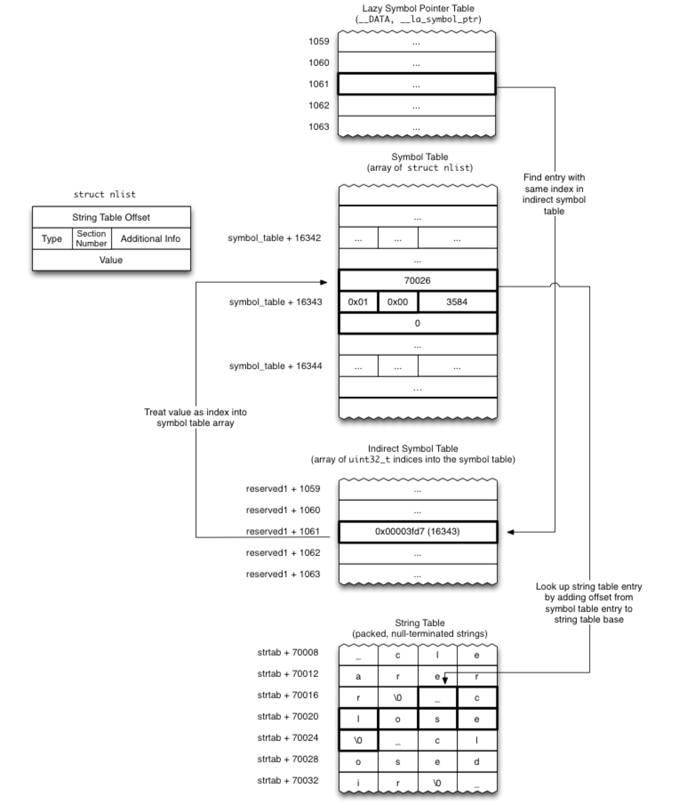
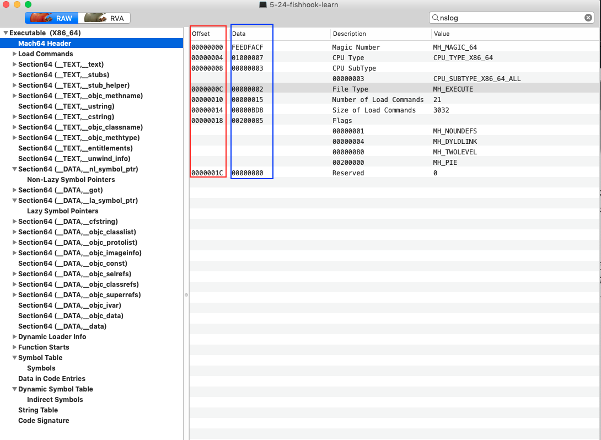
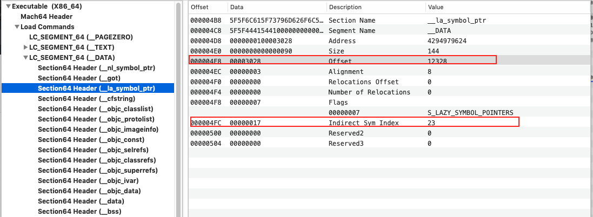
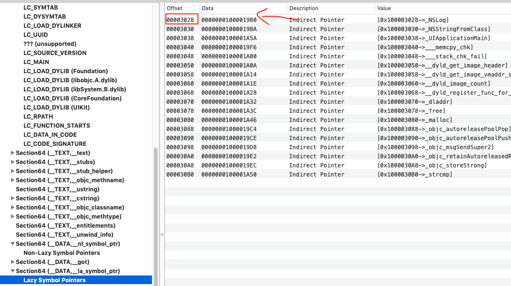
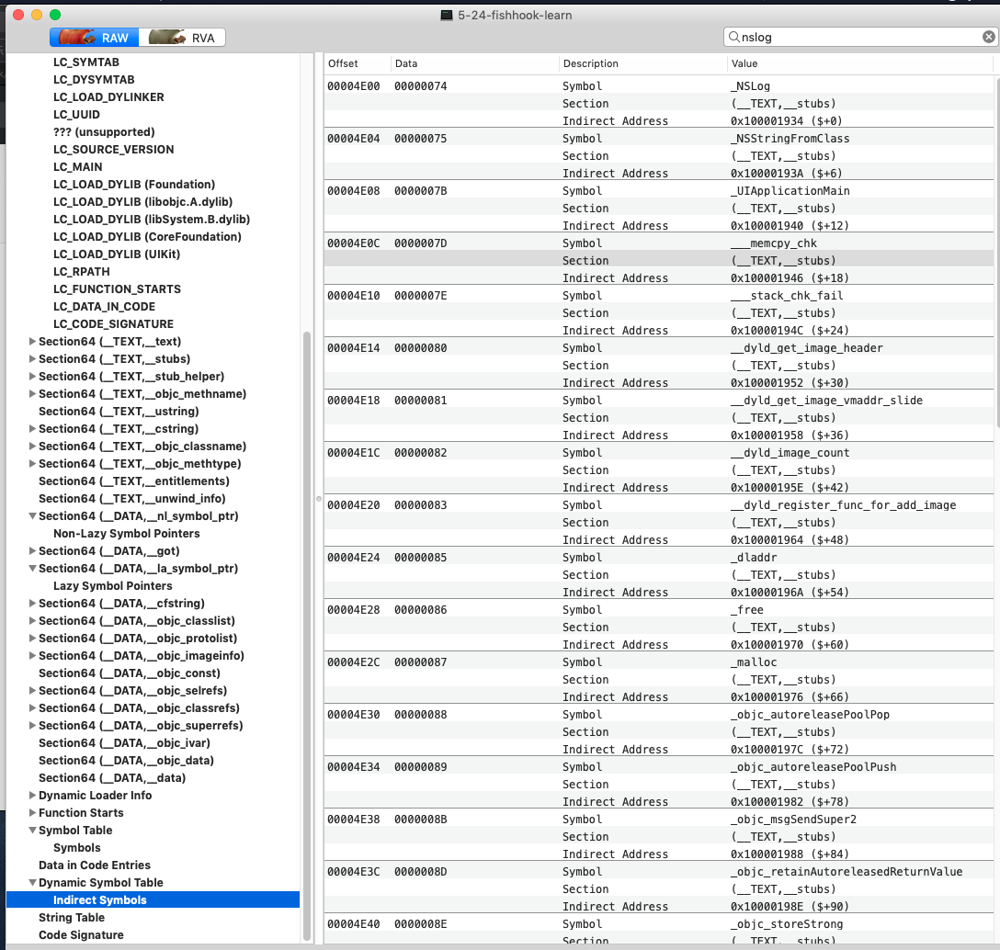
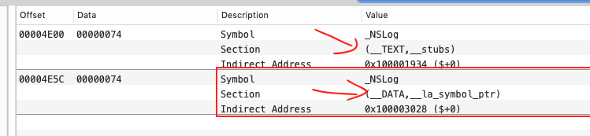
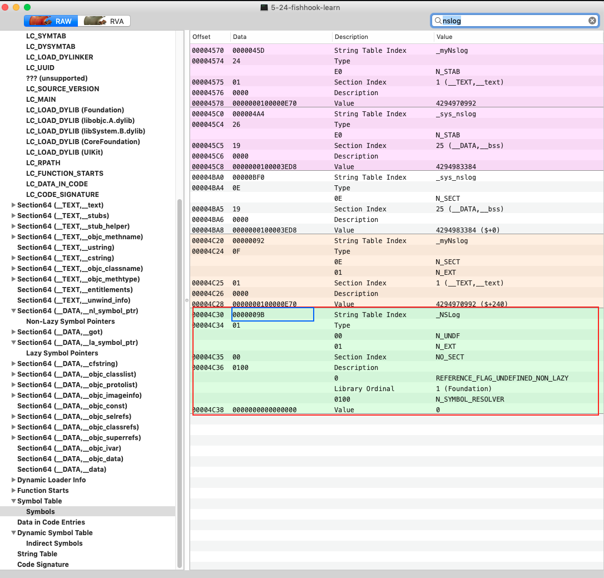
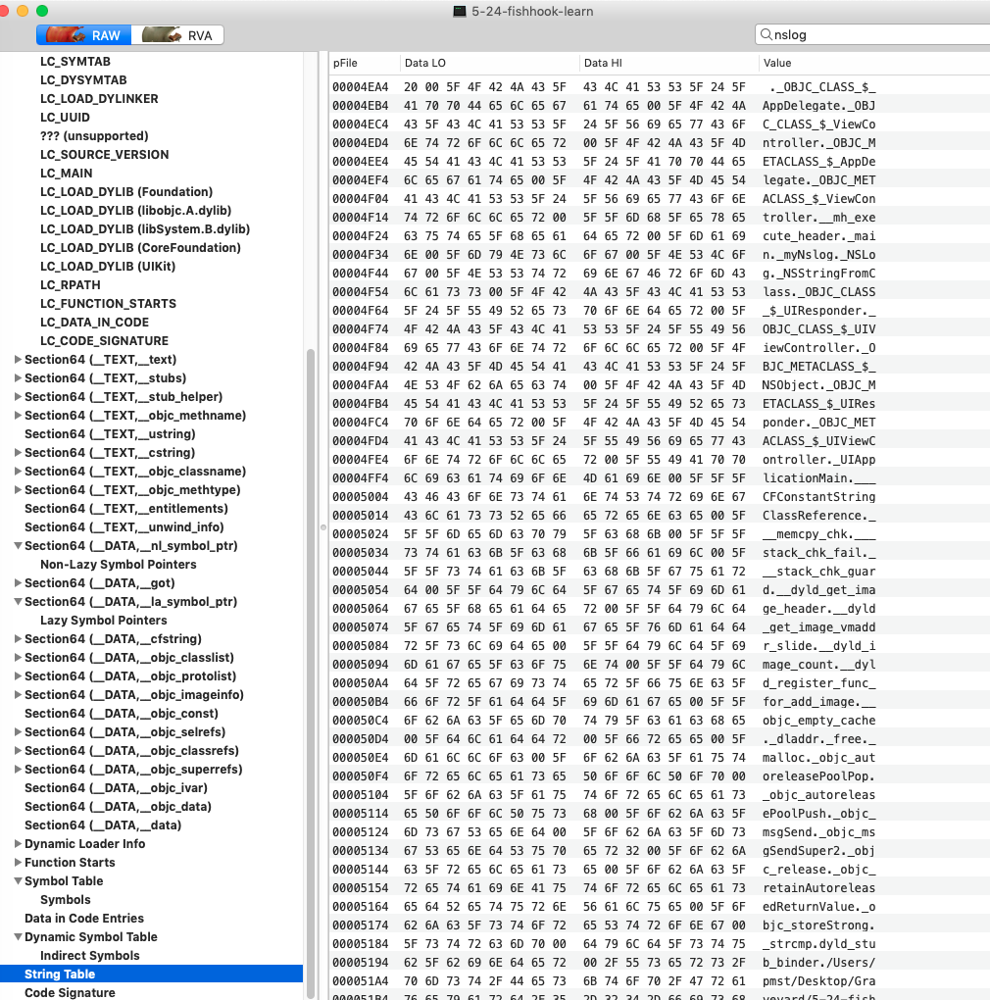
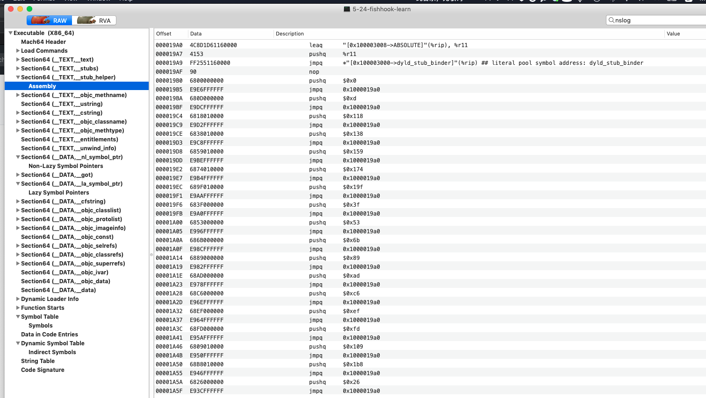

oc 代码：

```objective-c
- (void)viewDidLoad {
    [super viewDidLoad];
    
    NSLog(@"未绑定的系统调用1");
    NSLog(@"未绑定的系统调用2");
}
```

汇编代码：

```asm
    0x10950a6e8 <+24>: movq   0x25d9(%rip), %rsi        ; (void *)0x000000010950ccd8: ViewController
    0x10950a6ef <+31>: movq   %rsi, -0x18(%rbp)
    0x10950a6f3 <+35>: movq   0x25b6(%rip), %rsi        ; "viewDidLoad"
    0x10950a6fa <+42>: leaq   -0x20(%rbp), %rdi
    0x10950a6fe <+46>: callq  0x10950aa42               ; symbol stub for: objc_msgSendSuper2
    0x10950a703 <+51>: leaq   0x1956(%rip), %rsi        ; @
->  0x10950a70a <+58>: movq   %rsi, %rdi
    0x10950a70d <+61>: movb   $0x0, %al
    0x10950a70f <+63>: callq  0x10950aa24               ; symbol stub for: NSLog
    0x10950a714 <+68>: leaq   0x1965(%rip), %rsi        ; @
    0x10950a71b <+75>: movq   %rsi, %rdi
    0x10950a71e <+78>: movb   $0x0, %al
    0x10950a720 <+80>: callq  0x10950aa24               ; symbol stub for: NSLog
    0x10950a725 <+85>: addq   $0x20, %rsp
    0x10950a729 <+89>: popq   %rbp
    0x10950a72a <+90>: retq   
```

先用 `image list` 查询到应用可执行文件被装载到内存的起始地址 `0x0000000109509000`，然后用 MachOView 查询 `__DATA` 段中的 `lazy symbol` 符号，可以找到 NSLog 函数指针的偏移量 0x3020，两者相加查询该内存地址值：

```
(lldb) x 0x0000000109509000+0x3020
0x10950c020: 64 aa 50 09 01 00 00 00 5d d5 88 09 01 00 00 00  d.P.....].......
0x10950c030: 16 9b 5a 0d 01 00 00 00 78 aa 50 09 01 00 00 00  ..Z.....x.P.....
```

这里涉及到了很多次间接寻址，去 `0x010950aa64` 地址查看内容，这里我觉得是放置了指令，所以使用反汇编命令查看

```shell
(lldb) dis -s 0x010950aa64
    0x10950aa64: pushq  $0x0
    0x10950aa69: jmp    0x10950aa54 <--- 跳这个地址反汇编
    0x10950aa6e: pushq  $0xd
    0x10950aa73: jmp    0x10950aa54
    0x10950aa78: pushq  $0x3f
    0x10950aa7d: jmp    0x10950aa54
```

跳这个地址反汇编：

```shell
(lldb) dis -s 0x10950aa54
    0x10950aa54: leaq   0x15ad(%rip), %r11        ; (void *)0x0000000109555aa8: initialPoolContent + 5928
    0x10950aa5b: pushq  %r11
    0x10950aa5d: jmpq   *0x159d(%rip)             ; (void *)0x000000010c11c008: dyld_stub_binder <---- 这里
    0x10950aa63: nop    
    0x10950aa64: pushq  $0x0
    0x10950aa69: jmp    0x10950aa54
    0x10950aa6e: pushq  $0xd
```

最后指向的就是 `dyld_stub_binder` 核心函数；此次过后 `0x0000000109509000 + 0x3020` 内存值会被替换成真正的函数地址。

> 应用程序调用的所有外部系统函数，指针都是最终指向 `dyld_stub_binder` 绑定函数，经过这个函数之后，指针直接指向了对应的函数。
>
> * [ ] <font color=red>疑问一：加载外部函数库到应用程序可执行文件所处的内存中，而不是众多应用程序共用一份诸如 NSLog 代码。查了内存，替换后的NSLog函数地址为`0x010c2e71be`，而应用程序起始地址为`0x10bf4f000`。</font>
>
> * [ ] <font color=red>疑问二：`dyld_stub_binder` 是如何修改函数指针所处的那块内存地址，也就是偏移量+应用程序起始地址。</font>


关于使用也有几个疑问，如下代码中：

```c
struct rebinding nslog;
nslog.name = "NSLog";
nslog.replacement = myNslog;
nslog.replaced = (void *)&sys_nslog;
struct rebinding rebs[1] = {nslog};

rebind_symbols(rebs, 1);

static void (*sys_nslog)(NSString * format, ...);
void myNslog(NSString * format,...){
    format = [format stringByAppendingString:@"替换"];
    sys_nslog(format);
}
```

* [ ] <font color=red>1. 关于replaced的这个方法，每次都要自己写一个`static` 方法吗？和外部调用的系统函数(这里指NSLog)是同一个吗？还是说不一样，若不一样的话，为啥在myNslog中调用sys_nslog相当于调用了NSLog呢？能在MachOView中找到sys_nslog的定义吗？ </font>
* [ ] <font color=red>2.是否每调用 `rebind_symbols` 函数都会替换掉NSLog指向内存的值？改成`replacement`函数的地址，若是之前绑定过一次了，替换结构体的名字还是写NSLog吗？</font>

> 注意几点：
>
> * MachOView 查看一个Executable可执行文件， 内存地址就是从0x00000000 - 某个结束地址，所以Offset这一栏偏移量信息可以辅助你多次间接寻址，而Data这一栏才是真正的内存值。
>
> * MachOView 确实可以从 `__la_symbol section`段中看到Value 有 `[0x100003028 ->_NSLog]` 这么一栏，然后立马就能看到这块内存地址所处的偏移量为00003028，疑惑就来了：这个0x3028偏移量难道要考肉眼、人工去找？？自然不是，实际上是借助了Mach-O的Load Commands，这个在MachOView左侧的 `Load Commands->LC_SEGMENTS_64(__DATA)->Section64 Header(__la_symbol_ptr)`，有对la_symbol_ptr段的详细表述信息，其中Data一栏你会发现有个值为  0x3028偏移量，然后跳到 0x3028 这个偏移量多指向的内存，查看保存的值。

关于官方的这张图，整个流程图如下：




* `__nl_symbol_ptr`(no lazy symbol)  指library加载进来时就会绑定这些symbol;
* `__la_symbol_ptr`(lazy symbol) 指library加载进来不绑定，第一次用到的时候才绑定这些symbol，这样的符号一开始绑定的都是 `dyld_stub_binder` 这个routine来处理延迟加载绑定。


《[fishhook的实现原理浅析](https://juejin.im/post/5c7b43976fb9a04a05406312)》有部分内容是错误的，因此下面我按照NSLog例子进行勘误说明，首先从可执行文件 Executable 说起，首先Mach-O文件本质就是一长串、按照Apple约定的数据格式存储的二进制数据：可以是数据，也可以是指令。MachOView 牛逼在于帮你按照格式解析这个可执行文件，并且可视化显示出来，同时帮你分门别类好：

* 左侧边栏是MachOView帮你把二进制数据解析且分门别类可视化：LoadCommands 、Sections等等
* 红色的Offset就是辅助标识，告知你这块内存所处位置偏移量；
* 蓝色的才是内存数据，数据格式各不相同，有些可能是某个占4个字节，有些可能占0x4C字节，所以左侧的偏移量差值可不是固定的。



Apple是按照约定的数据格式存储的，所以解析只要按照格式来就行，比如你知道可执行文件一开始就是一个 Mach_Header结构体，后面紧跟着的就是元素为 Load Command 的数组，每个Load Command数据结构也是已知的，我们关心的是 `LC_SEGMENT_64(__DATA)`中的 `__la_symbol_ptr Section Header`，同样是一个固定格式的数据，所以我们能找到它！



上面用结构体表示为：

```c
struct section_64 { /* for 64-bit architectures */
	char		sectname[16];	/* name of this section */
	char		segname[16];	/* segment this section goes in */
	uint64_t	addr;		/* memory address of this section */
	uint64_t	size;		/* size in bytes of this section */
	uint32_t	offset;		/* file offset of this section */
	uint32_t	align;		/* section alignment (power of 2) */
	uint32_t	reloff;		/* file offset of relocation entries */
	uint32_t	nreloc;		/* number of relocation entries */
	uint32_t	flags;		/* flags (section type and attributes)*/
	uint32_t	reserved1;	/* reserved (for offset or index) */
	uint32_t	reserved2;	/* reserved (for count or sizeof) */
	uint32_t	reserved3;	/* reserved */
};
```

> 重点是在 Data 这一栏，才是内存中实际存的值！

第一个红色圈出的就是结构体中的 offset，值为0x3028，通过它可以找到 ` la_symbol_ptr  DATA Section`:



而内存偏移0x3028处的值 0x1000019B0 表示什么呢？这个之后再说。

继续说回第二个红色圈出的就是 reserved1，其值为0x17=23，表示在 Dynamic Symbol Table 中第23个元素，一个元素就是一个 Indirect Symbol：



教程中说是第一个，实际上不是，而是应该往下数第23个，如果你懒得数，可以右上角搜索。



尽管两者的值是一致的，都是0x74，这个也是个索引值，通过它去 Symbol Table 中找NSLog这个符号：



如果想验证索引正确性，你可以通过offset相减就可以验证了，甚至你都可以一个个数，orz。

继续说回来，这里的0x9B也算一个偏移量，需要去StringTable去找，这个表存储的就是字符串常量。。。



这里就相对简单了，直接 0x4EA4 + 0x9B 就可以发现就是NSLog字符串了，**但是这里并不是函数实现地址！！！！！**

内存偏移0x3028处的值 0x1000019B0表示啥？这个就是内存偏移量：取0x19B0。然后用MachOView查看，很容易就能找到：



看到反汇编就是 dyld_stub_binder 函数。


说了一堆，还是没扯到fishhook如何替换的函数，以及如何多次间接寻址。这个直接看fishhook源码。今天收获还是蛮大的。


